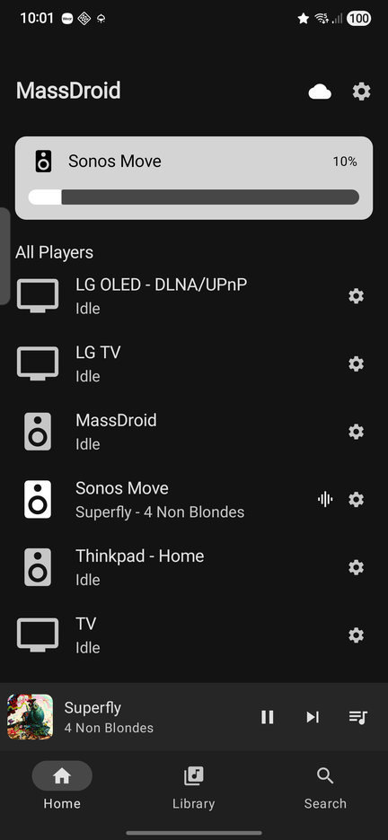
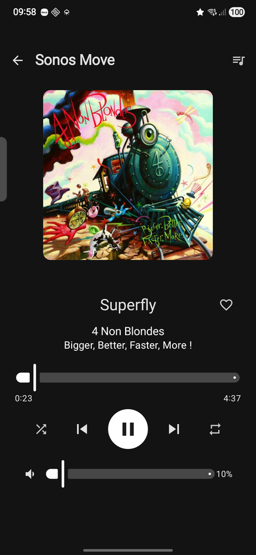
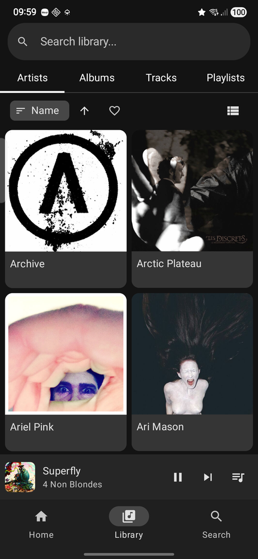
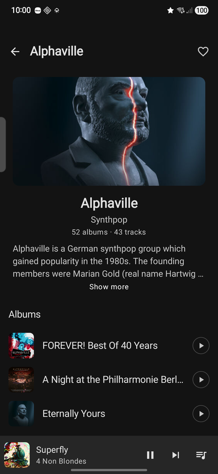
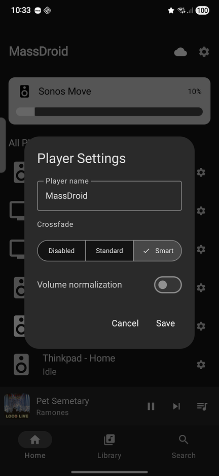

#  MassDroid

Native Android client for [Music Assistant](https://music-assistant.io/), the open-source music server that integrates all your music sources and players.

MassDroid lets you control your Music Assistant players, browse your library, manage queues, and even turn your phone into a speaker.

## Screenshots

<p align="center">
  
  
  
  
  
</p>

## Features

- **Player Controls**
- **Library Browsing** : Artists, Albums, Tracks, Playlists with search, sort, and grid/list views
- **Now Playing** : Full-screen player with album art, seek bar, and favorite toggle
- **Queue Management** : View, reorder, and manage the playback queue
- **Phone as Speaker** : Turn your phone into a Music Assistant speaker using the Sendspin protocol (Opus audio streaming)
- **Favorites** : Mark artists, albums, tracks, and playlists as favorites - filter library by favorites
- **Media Session** : Android media notification with playback controls
- **Player Settings** : Rename players, set icons, configure crossfade and volume normalization
- **mTLS Support** : Client certificate authentication for secure remote access
- **MiniPlayer** : Persistent mini player bar across all screens

## Tech Stack

- Kotlin + Jetpack Compose
- Material 3 (Material You)
- MVVM architecture with StateFlow
- Hilt dependency injection
- OkHttp WebSocket (Music Assistant API)
- Coil for image loading
- Media3 / MediaSession for system integration
- kotlinx.serialization
- Compose Navigation

## How It Works

MassDroid communicates with your Music Assistant server over a persistent WebSocket connection. All player state, library data, queue changes, and favorites are synced in real time through server-pushed events. The app never polls; updates appear instantly as they happen on the server or from other clients.

When Sendspin is enabled, the phone registers as a Music Assistant player. Audio is streamed as Opus frames over a second WebSocket, decoded on-device, and played through the phone speaker or headphones.

## Requirements

- Android 8.0+ (API 26)
- A running [Music Assistant](https://music-assistant.io/) server (v2.x)

## Building

```bash
# Debug build
./gradlew assembleDebug

# Release build
./gradlew assembleRelease

# Run static analysis
./gradlew detekt
```

## Connecting

1. Open MassDroid and go to **Settings**
2. Enter your Music Assistant server URL (e.g. `http://192.168.1.100:8095`)
3. Log in with your Music Assistant credentials
4. Your players will appear on the Home screen

For remote access, you can configure mTLS with a client certificate in Settings.

## License

This project is licensed under the MIT License. See [LICENSE](LICENSE) for details.
